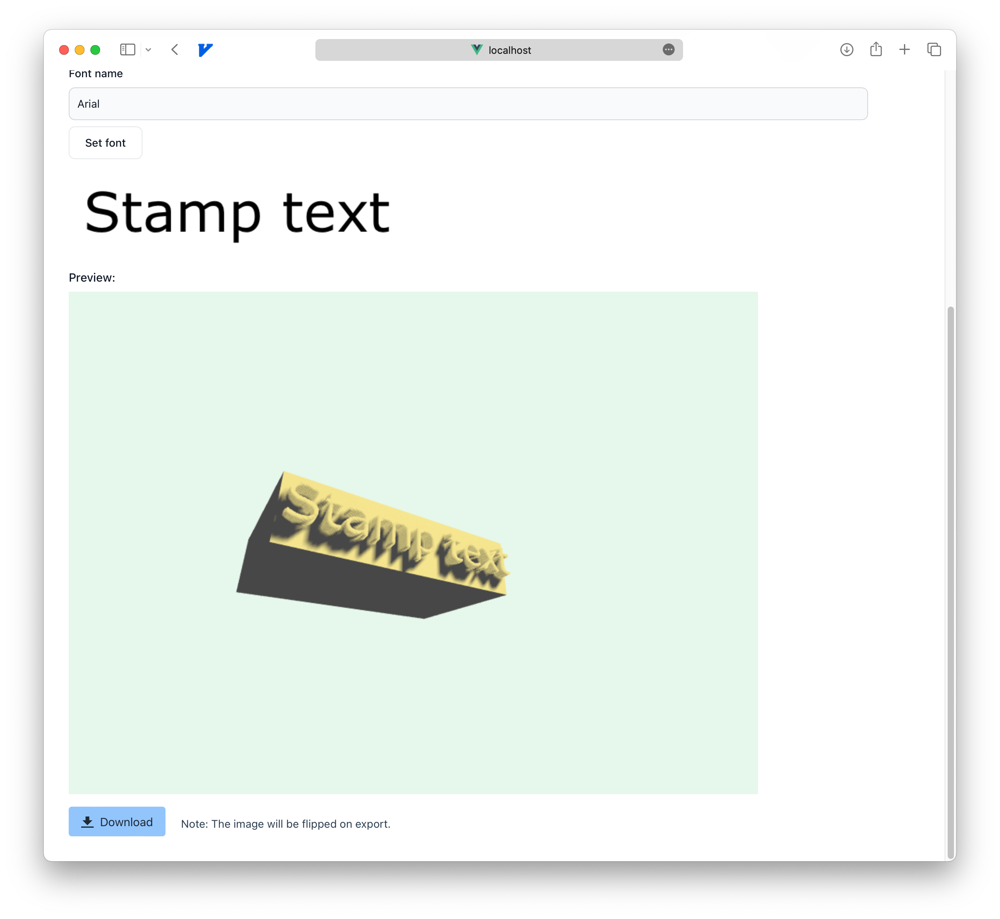

# Stempelmeister



Allows you to create 3d models for stamps you can print.

## Description
1. Change **text**, **font** and **embossing** as much as you like and see the result in realtime in your browser. 
2. Click the Download Button and download a printable **STL file** you can use in your slicing software.

Note: The exported model will have automatically flattened peaks for better paper coverage.

## Tested Browsers

This should run in all browsers supporting webcanvas and modern javascript modules. I have tested it in:

| Browser     | Version   |
|-------------|-----------|
| Safari      | 16.6      |
| Chrome      | 116      |


## Project Setup

```sh
npm install
```

### Compile and Hot-Reload for Development

```sh
npm run dev
```

### Type-Check, Compile and Minify for Production

```sh
npm run build
```
